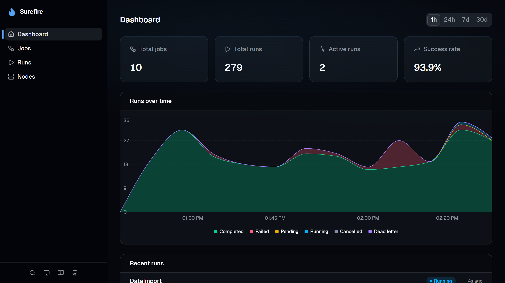

# Surefire

[](https://github.com/sgbj/surefire/actions/workflows/ci.yml)
[](https://www.nuget.org/packages/Surefire)

Distributed job scheduling for .NET with a minimal API style.

> **Preview:** Surefire is pre-1.0, so APIs and storage schemas may change.

```csharp
var builder = WebApplication.CreateBuilder(args);

builder.Services.AddSurefire();

var app = builder.Build();

app.AddJob("Hello", () => "Hello, World!");

app.MapSurefireDashboard();

app.Run();
```



## Features

- Runs across multiple nodes with coordinated claiming and retry handling. Nodes can register the same or different
  jobs.
- Built-in dashboard with live logs, progress, run history, and node monitoring.
- Per-job cron, retries, queues, timeouts, and rate limits.
- Stream values into and out of jobs with `IAsyncEnumerable<T>`. Run batches and consume their results as a list or a
  stream.
- Call jobs from other jobs using `IJobClient`.
- OpenTelemetry traces and metrics. ASP.NET Core health checks.

## Install

```bash
dotnet add package Surefire
dotnet add package Surefire.Dashboard
```

Comes with an in-memory store and notifications. Provider packages are available for PostgreSQL, SQL Server, SQLite, and
Redis.

```bash
dotnet add package Surefire.PostgreSql
dotnet add package Surefire.SqlServer
dotnet add package Surefire.Sqlite
dotnet add package Surefire.Redis
```

```csharp
builder.Services.AddNpgsqlDataSource(builder.Configuration.GetConnectionString("Surefire")!);

builder.Services.AddSurefire(options => options.UsePostgreSql());
```

## Defining jobs

Register jobs as delegates with `AddJob`. Parameters resolve from DI and from arguments passed when triggering a run.
`AddJob` returns a builder that can be used to configure cron, retries, timeouts, rate limits, callbacks, etc.

```csharp
app.AddJob("Add", (int a, int b) => a + b);

app.AddJob("ImportData", async (JobContext ctx, ILogger<Program> logger, CancellationToken ct) =>
{
    for (var i = 1; i <= 10; i++)
    {
        logger.LogInformation("Step {I}/10", i);
        await ctx.ReportProgressAsync(i / 10.0);
        await Task.Delay(1000, ct);
    }
})
.WithDescription("Imports data and reports progress")
.WithRetry(3);

app.AddJob("GenerateReport", async (IReportService reports, CancellationToken ct) =>
{
    await reports.GenerateReportAsync(ct);
})
.WithCron("0 * * * *");
```

## Triggering jobs

Use `IJobClient` to trigger jobs from anywhere in your app, including inside other jobs.

```csharp
// Fire and forget
await client.TriggerAsync("ImportData");

// Run a job and wait for the result
var sum = await client.RunAsync<int>("Add", new { a = 1, b = 2 });

// Or stream values as they're produced
await foreach (var value in client.StreamAsync<int>("GenerateNumbers"))
{
    // ...
}

// Run a batch and get all results at once
var results = await client.RunBatchAsync<Result>("Process", inputs);

// Or stream batch results as they finish
await foreach (var result in client.StreamBatchAsync<Result>("Process", inputs))
{
    // ...
}
```

Inject `IJobClient` into a job to call other jobs from inside it:

```csharp
app.AddJob("AddRandom", async (IJobClient client, CancellationToken ct) =>
{
    var a = Random.Shared.Next(1, 101);
    var b = Random.Shared.Next(1, 101);
    var sum = await client.RunAsync<int>("Add", new { a, b }, cancellationToken: ct);
    return new { a, b, sum };
});
```

## Lifecycle callbacks

```csharp
app.AddJob("ProcessOrder", async (int orderId) => { /* ... */ })
    .WithRetry(3)
    .OnSuccess((JobContext ctx) =>
    {
        // Run succeeded
    })
    .OnRetry((JobContext ctx, ILogger<Program> logger) =>
    {
        logger.LogWarning("Attempt {Attempt} failed", ctx.Attempt);
    })
    .OnDeadLetter((JobContext ctx) =>
    {
        // All retries exhausted
    });
```

`OnSuccess` fires when a run succeeds. `OnRetry` fires when Surefire schedules another attempt after a failure.
`OnDeadLetter` fires when no retries remain.

## Dashboard

```csharp
app.MapSurefireDashboard();    // at /surefire
app.MapSurefireDashboard("/"); // at the root
```

Includes an embedded dashboard that lets you:

- Trigger jobs, enable or disable them, and pause queues
- Cancel runs or rerun completed ones
- View traces, child runs, errors, arguments, and results
- Use a REST API at `{prefix}/api/` for the same actions

If you expose the dashboard outside local development, be sure to configure the returned endpoint group with
authorization.

## Documentation

See the full documentation at [batary.dev/surefire](https://batary.dev/surefire).

## License

MIT
