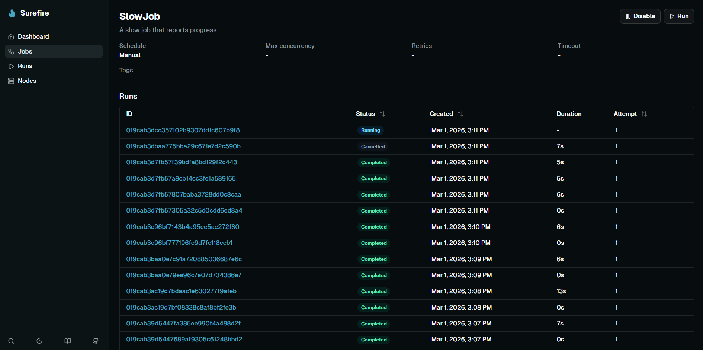
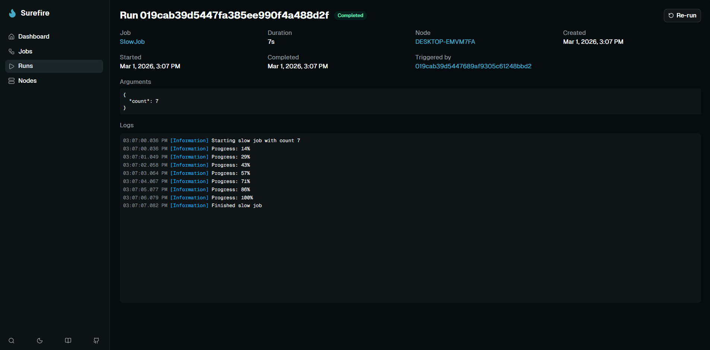

## Setup

```csharp
app.MapSurefireDashboard();           // at /surefire
app.MapSurefireDashboard("/admin");   // custom prefix
```

The dashboard is embedded in the `Surefire.Dashboard` package — no extra files or build steps.

## Home

The home page gives you a quick overview:

- **Stat cards** — total jobs, total runs, active runs, and success rate.
- **Runs over time** — a stacked area chart showing runs by status. Toggle between 1h, 24h, 7d, and 30d.
- **Recent runs** — the latest runs with status badges.

## Jobs

Lists all registered jobs with their name, description, cron schedule, enabled/disabled status, and tags.

Click into a job to:

- **Enable or disable** it (disabling stops cron scheduling).
- **Trigger a run** with optional JSON arguments and a scheduled start time.
- See the job's **run history** with pagination.



## Runs

Lists all runs with filters for job name, status, and date range.

Click into a run to see:

- **Live progress bar** for running jobs.
- **Streaming logs** that update in real-time as the job runs.
- **Arguments and result** as formatted JSON.
- **Error details** for failed runs.
- **Retry chain** — links between retry attempts.
- **Triggered runs** — any child runs this job created.
- **Cancel** a running job or **re-run** a completed one.



## Nodes

Lists all scheduler nodes with their status, last heartbeat, running job count, and registered jobs.

Click into a node to see what jobs it handles and its recent run history.

## API

The dashboard also exposes a REST API at `{prefix}/api/`. A few examples:

```
GET  /api/stats?since=2025-01-01T00:00:00Z&bucketMinutes=60
GET  /api/jobs
GET  /api/runs?jobName=Cleanup&status=3&take=20
POST /api/jobs/Cleanup/trigger
POST /api/runs/{id}/cancel
GET  /api/runs/{id}/stream          (SSE)
```
