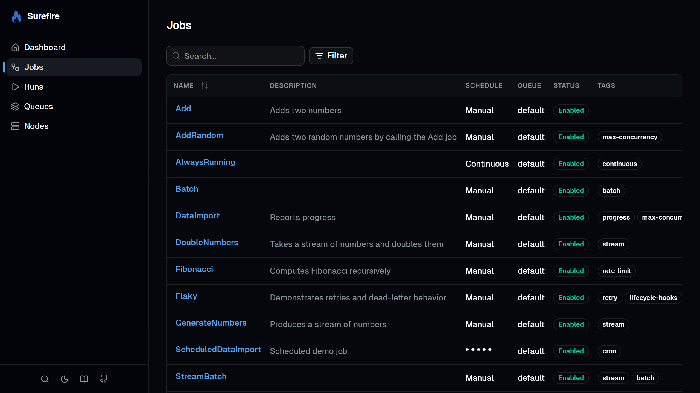
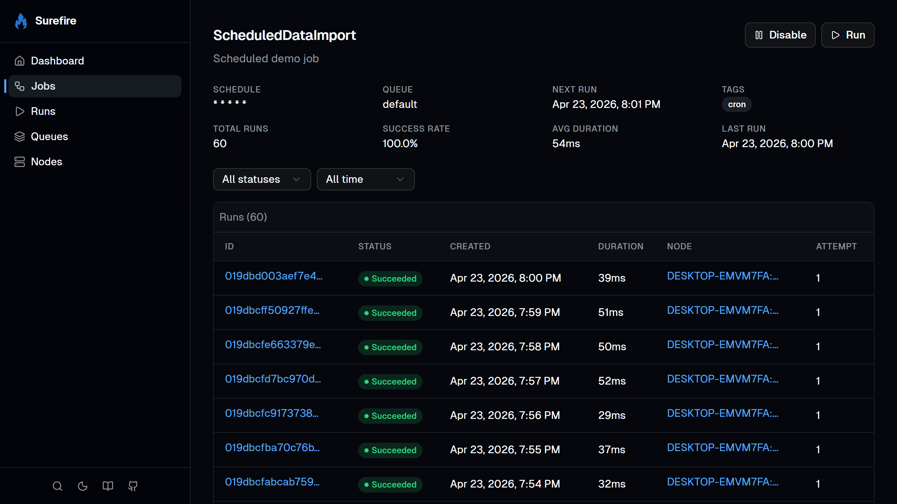
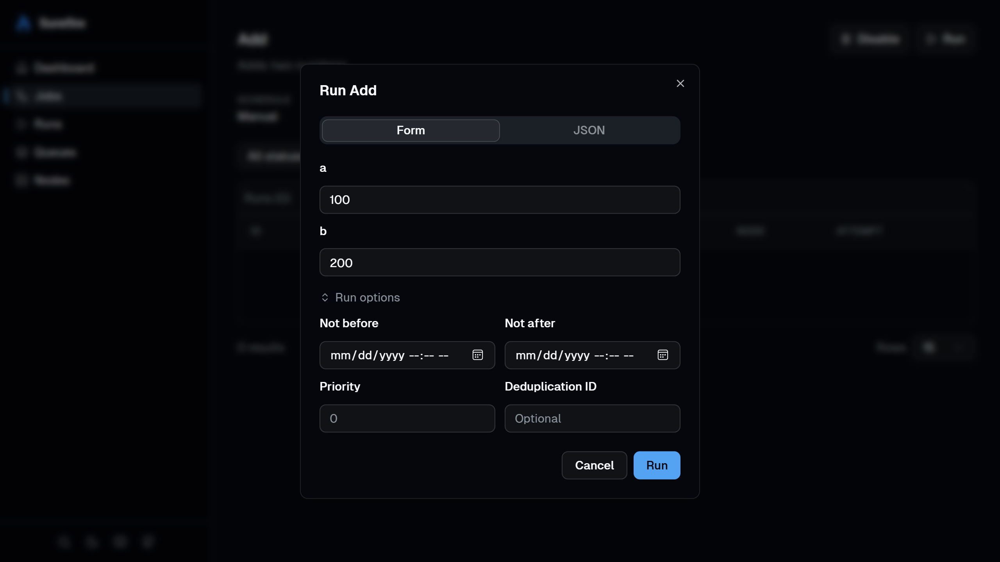
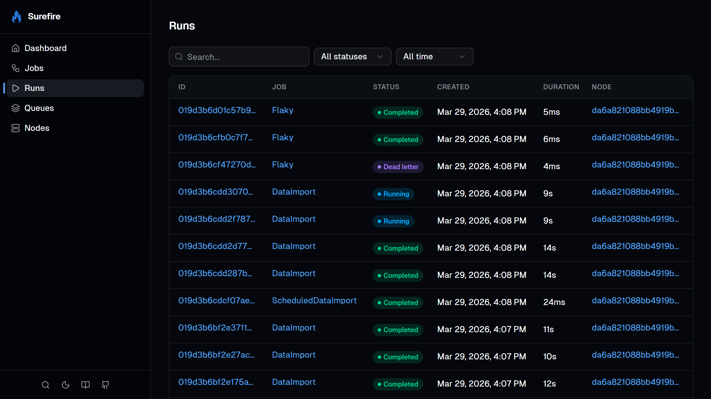
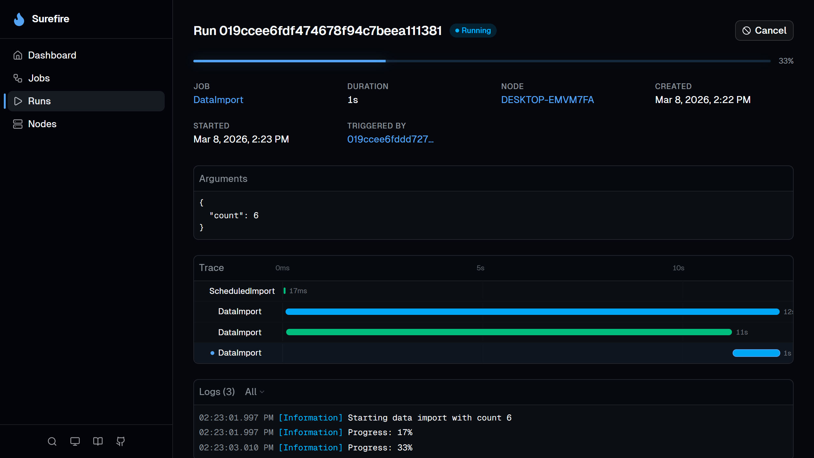
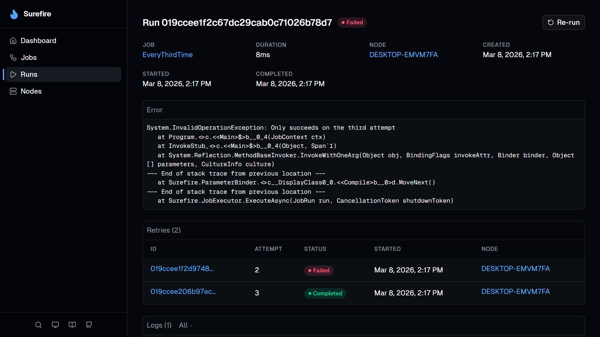
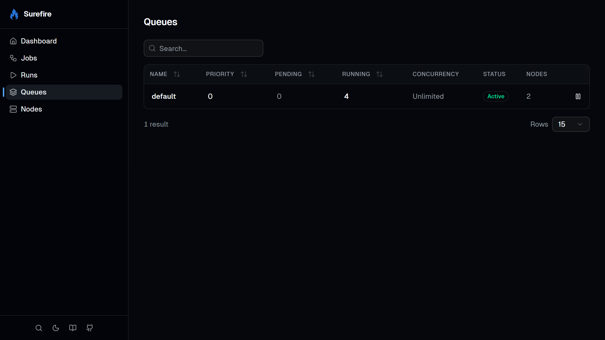
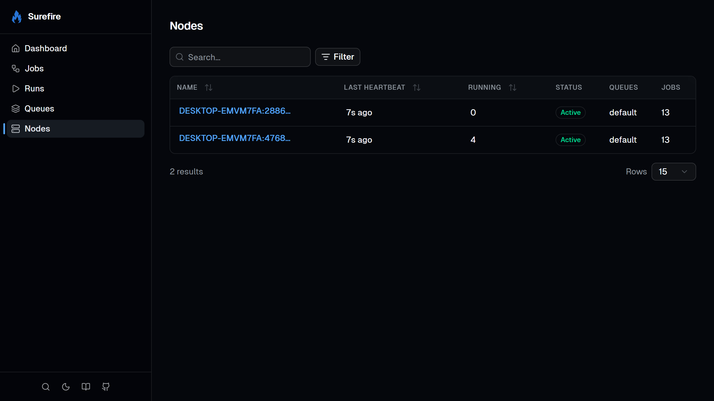
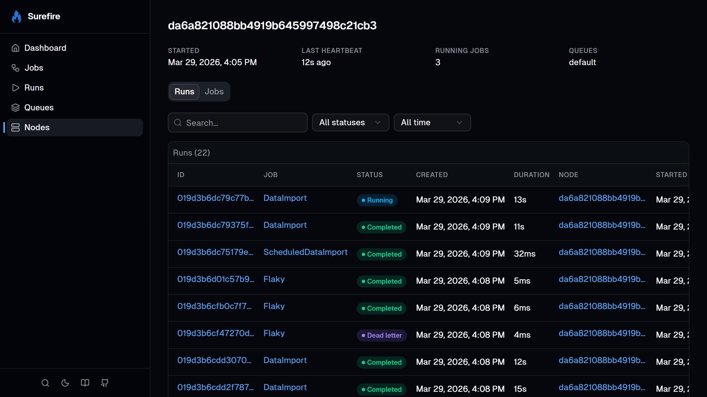
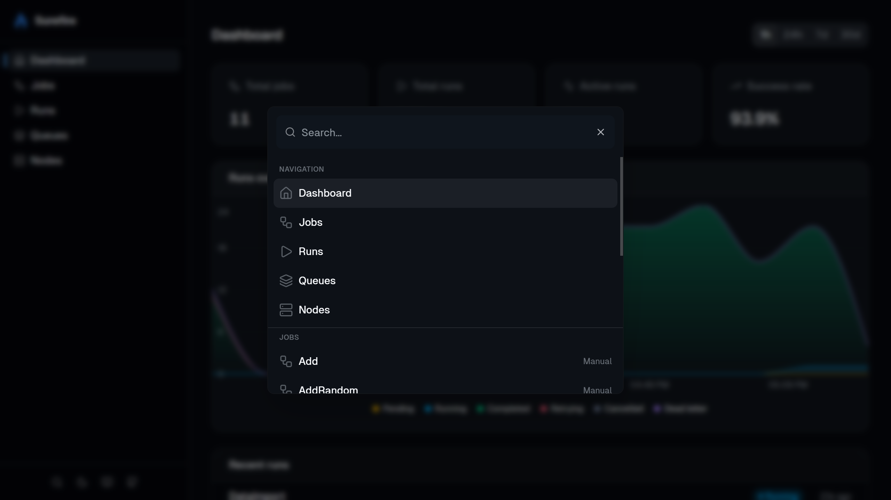

## Setup

```csharp
app.MapSurefireDashboard();           // at /surefire
app.MapSurefireDashboard("/admin");   // custom prefix
```

The dashboard is embedded in the `Surefire.Dashboard` package, with no extra files or build steps.

## Authorization

Anyone who can reach the dashboard can view job arguments and results, trigger jobs, cancel runs, rerun completed work, and pause queues.

:::caution
If you expose the dashboard outside local development, require authorization on the returned endpoint group.
:::

```csharp
app.MapSurefireDashboard()
    .RequireAuthorization("AdminPolicy");
```

## Home

The home page gives you a quick overview:

- **Stat cards**: total jobs, total runs, active runs, and success rate.
- **Runs over time**: a stacked area chart showing runs by status. Toggle between 1h, 24h, 7d, and 30d.
- **Recent runs**: the latest runs with status badges.


## Jobs

Lists all registered jobs with their name, description, cron schedule, enabled/disabled status, and tags.



Click into a job to:

- **Enable or disable** it (disabling stops cron scheduling).
- **Trigger a run** with optional JSON arguments, a scheduled start time, and priority.
- See the job's **run history** with pagination.





## Runs

Lists all runs with filters for job name, status, and date range.



Click into a run to see:

- **Live progress bar** for running jobs.
- **Streaming logs** that update in real-time as the job runs.
- **Arguments and result** as formatted JSON.
- **Error details** for failed runs.
- **Trace view**: a timeline of parent/child run relationships.
- **Rerun chain**: navigation between a run and any reruns of it.
- **Triggered runs**: any child runs this job created.

From the run page, you can also cancel a running job or rerun a completed one.





## Queues

Lists all queues with their pending run count, concurrency limits, and paused status. You can pause and resume queues from this page. See the [queues concept page](/surefire/concepts/queues/) for more on how queues work.



## Nodes

Lists all scheduler nodes with their last heartbeat, running job count, and registered jobs.



Click into a node to see what jobs it handles and its recent run history.



## Command palette

Press <kbd>/</kbd> or <kbd>Ctrl+K</kbd> (<kbd>⌘K</kbd> on Mac) to open the command palette. Jump to any of the main pages, or search for a specific job or node by name.



## REST API

The dashboard is built on a REST API at `{prefix}/api/`. Use it to query jobs and runs, stream run updates, and manage runs and queues from your own tools.

```
GET   /api/stats                                    # dashboard statistics
GET   /api/jobs                                     # list all jobs
GET   /api/jobs/{name}                              # get a single job
GET   /api/jobs/{name}/stats                        # get job-level stats
PATCH /api/jobs/{name}                              # update a job (enable/disable)
POST  /api/jobs/{name}/trigger                      # trigger a new run
GET   /api/runs?jobName=X&take=20                   # list runs with filters
GET   /api/runs/{id}                                # get a single run
GET   /api/runs/{id}/logs                           # get parsed log events
GET   /api/runs/{id}/stream                         # live logs & progress (SSE)
GET   /api/runs/{id}/trace?siblingWindow=50&childrenTake=100   # tree-aware focused trace (ancestors + focus + siblings + first-page children)
GET   /api/runs/{id}/children?afterCursor=...&take=100         # paginate direct children (forward or reverse via beforeCursor)
POST  /api/runs/{id}/cancel                         # cancel a running job
POST  /api/runs/{id}/rerun                          # re-run a completed run
GET   /api/queues                                   # list all queues
PATCH /api/queues/{name}                            # update a queue (pause/resume)
GET   /api/nodes                                    # list all nodes
GET   /api/nodes/{name}                             # get a single node
```
