## Setup

```csharp
builder.Services.AddSurefireDashboard();
// ...
app.MapSurefireDashboard();           // at /surefire
app.MapSurefireDashboard("/admin");   // custom prefix
```

The dashboard is embedded in the `Surefire.Dashboard` package, with no extra files or build steps.

Pass a `configure` callback to override defaults:

```csharp
builder.Services.AddSurefireDashboard(options =>
{
    options.MaxTreeRuns = 100_000; // cap the run tree response (default: 50_000)
});
```

## Authentication

The dashboard is **secure by default**. Anyone who can reach it can view job arguments and results, trigger jobs, cancel runs, rerun completed work, and pause queues, so out of the box it requires a browser token, the same model as the .NET Aspire dashboard.

### Browser token (default)

With no configuration at all, Surefire generates a random token at startup and logs the login URL:

```text
info: Surefire.Dashboard.DashboardLoginUrlLogger[0]
      Surefire dashboard: http://localhost:5000/surefire/login?t=4f2a9c...
```

Click the link (or paste the token into the login page) and you're in. The token is exchanged for a standard ASP.NET Core auth cookie (3-day sliding expiration). API calls without it get `401`; browser navigation gets redirected to `{prefix}/login`. To sign every session out, rotate the token: cookies are bound to the token they were issued for, so changing it (or restarting an app that uses a generated token) invalidates them all immediately.

Pin the token instead of generating one. This is required when you run multiple replicas, since each process would otherwise generate its own:

```csharp
builder.Services.AddSurefireDashboard(options =>
{
    options.BrowserToken = builder.Configuration["DashboardToken"];
});
```

or set the `Surefire:Dashboard:BrowserToken` configuration key (for example the `Surefire__Dashboard__BrowserToken` environment variable) with no code at all. Explicitly configured tokens are never written to the logs.

When running multiple replicas, the replicas must also share an ASP.NET Core [Data Protection](https://learn.microsoft.com/aspnet/core/security/data-protection/configuration/overview) key ring. The auth cookie is encrypted with it, and a cookie issued by one replica has to validate on the others:

```csharp
builder.Services.AddDataProtection()
    .PersistKeysToFileSystem(new DirectoryInfo("/shared/keys")) // or blob/Redis/etc.
    .SetApplicationName("my-app");
```

The symptom when this is missing: signing in appears to work, but you intermittently bounce back to the login page depending on which replica serves the request.

### Bring your own auth

If your app already has authentication (cookies, OIDC, anything), hand the dashboard over to it:

```csharp
builder.Services.AddSurefireDashboard(options =>
{
    options.AuthMode = DashboardAuthMode.HostAuthorization;
});

app.MapSurefireDashboard()
    .RequireAuthorization("AdminPolicy"); // any policy, scheme, or role you already use
```

In this mode the dashboard adds no auth of its own. It is protected by whatever you chain on the returned endpoint group, or by your app's global fallback policy. If nothing protects it, app startup fails with an exception telling you so, instead of quietly serving the dashboard to the world. (To check this, the app's endpoints are built during startup in this mode, so unrelated route configuration errors also surface at startup instead of on first request.)

### Opting out

For local-only setups, or when something outside the endpoint pipeline already protects the dashboard (reverse-proxy auth, a path-gating middleware) and the startup check can't see it, you can turn the built-in auth off entirely. This is deliberate and loud; a warning is logged at startup:

```csharp
builder.Services.AddSurefireDashboard(options =>
{
    options.AuthMode = DashboardAuthMode.Unsecured;
});
```

:::caution
`Unsecured` means anyone who can reach the dashboard can manage your jobs. Never expose it beyond local development.
:::

### Notes

- Built-in auth uses a dedicated cookie scheme and authorization policy (both named `"SurefireDashboard"`), so it never interferes with your app's own schemes, and your app's default scheme can't accidentally unlock the dashboard.
- It relies on the standard authentication and authorization middleware. `WebApplication` inserts that automatically when auth services are registered; hosts building the pipeline by hand need `UseAuthentication()` and `UseAuthorization()` between `UseRouting()` and `UseEndpoints()`.
- The cookie is `HttpOnly`, `SameSite=Lax`, and `Secure` on HTTPS. `SameSite=Lax` keeps browsers from attaching it to cross-site POSTs, and endpoints that accept a body additionally require `application/json`, so no separate antiforgery setup is needed.
- Additional policies chained onto `MapSurefireDashboard()` combine with the built-in token policy (all must pass); they don't replace it. To fully own auth, use `HostAuthorization`.

## Home

The home page gives you a quick overview:

- **Stat cards**: total jobs, total runs, active runs, success rate, and nodes.
- **Status**: a stacked bar showing the share of runs by status.
- **Activity**: a stacked area chart of runs by status over time.
- **Latest runs**: the most recent runs with status badges.

Use the period selector in the top bar to scope **Status** and **Activity** to 1h, 24h, 7d, or 30d.

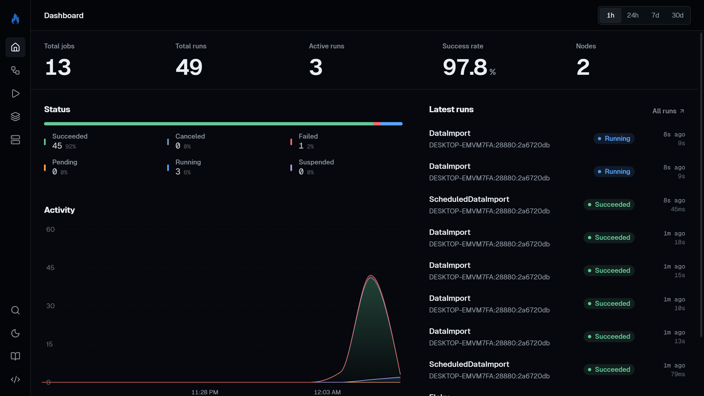

## Jobs

Lists all registered jobs with their name, description, cron schedule, enabled/disabled status, and tags.

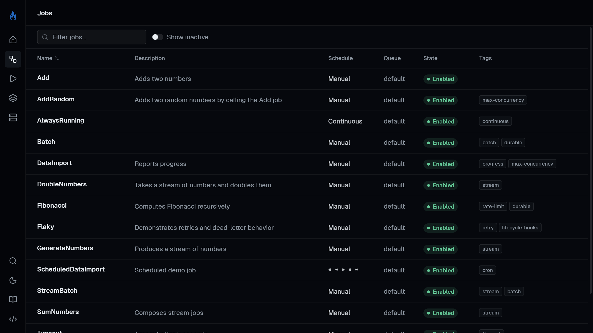

Click into a job to:

- **Enable or disable** it (disabling stops cron scheduling).
- **Trigger a run** with optional JSON arguments, a scheduled start time, and priority.
- See the job's **run history** with pagination.

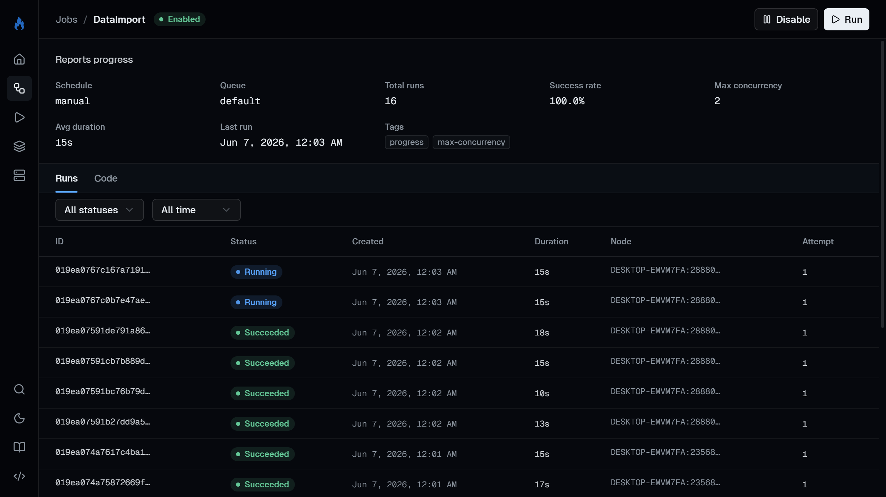

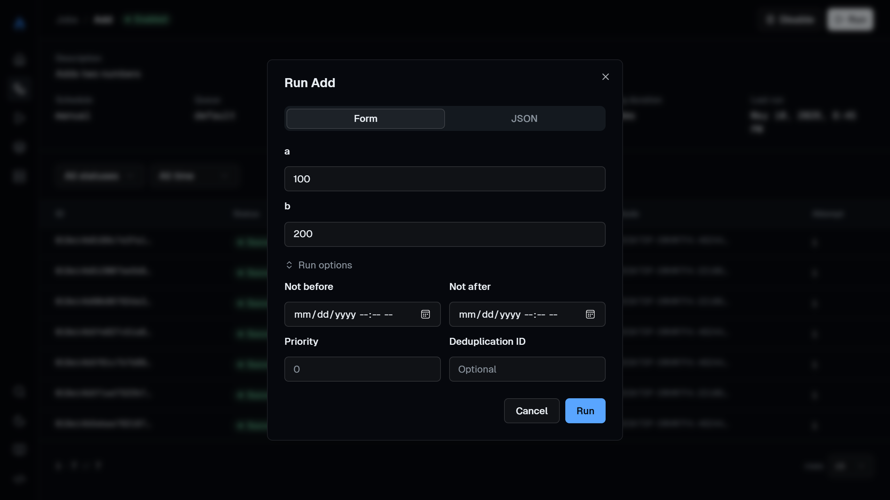

## Runs

Lists all runs with filters for job name, status, and date range.

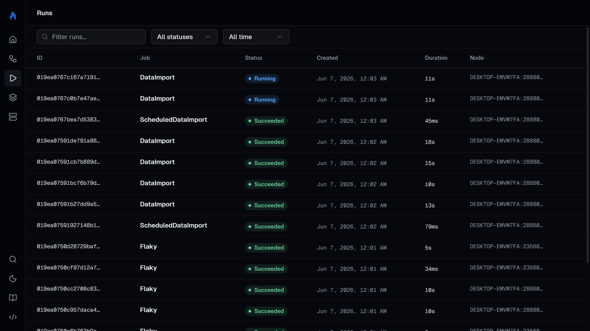

Click into a run to see:

- **Live progress bar** for running jobs.
- **Streaming input, output, and logs** that update in real-time as the job runs.
- **Arguments** and **result** as formatted JSON.
- **Error details** for failed runs, with per-attempt stack traces.
- **Trace**: the full run tree (ancestors, current run, and descendants) with depth and live status.
- **Rerun chain**: links to the original run and any reruns of it.

From the run page, you can also cancel a running job or rerun a completed one.

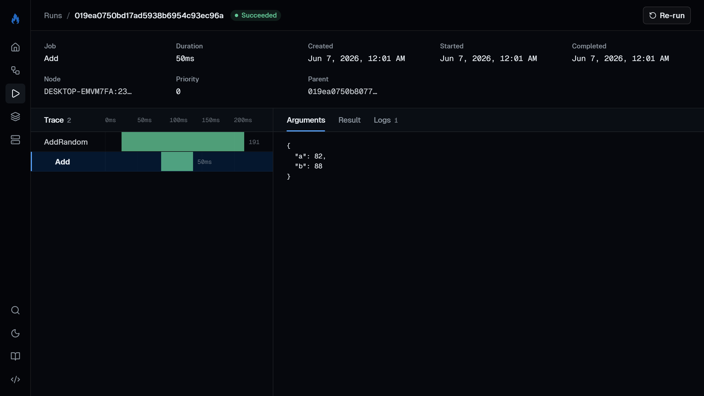

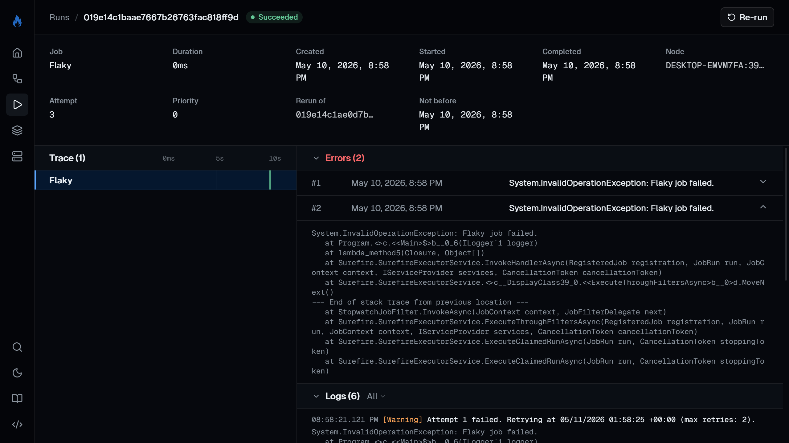

## Queues

Lists all queues with their pending run count, concurrency limits, and paused status. You can pause and resume queues from this page. See the [queues concept page](/surefire/concepts/queues/) for more on how queues work.

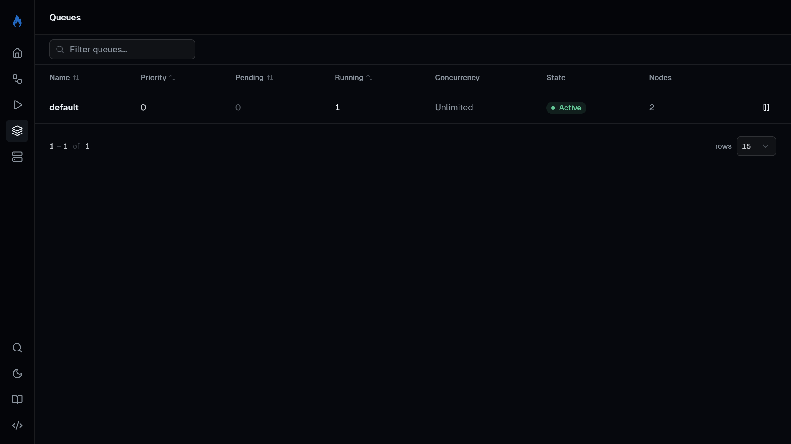

## Nodes

Lists all scheduler nodes with their last heartbeat, running job count, and registered jobs.

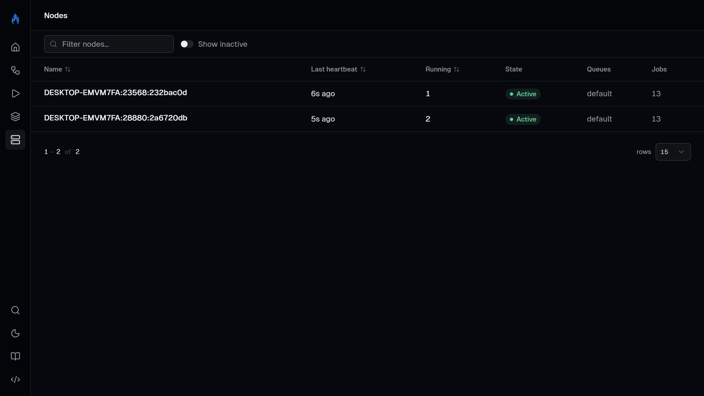

Click into a node to see what jobs it handles and its recent run history.

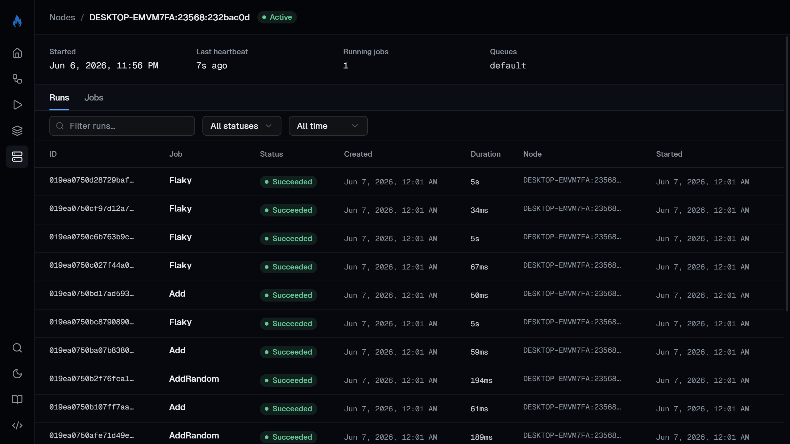

## Command palette

Press <kbd>/</kbd> or <kbd>Ctrl+K</kbd> (<kbd>⌘K</kbd> on Mac) to open the command palette. Jump to any of the main pages, or search for a specific job or node by name.

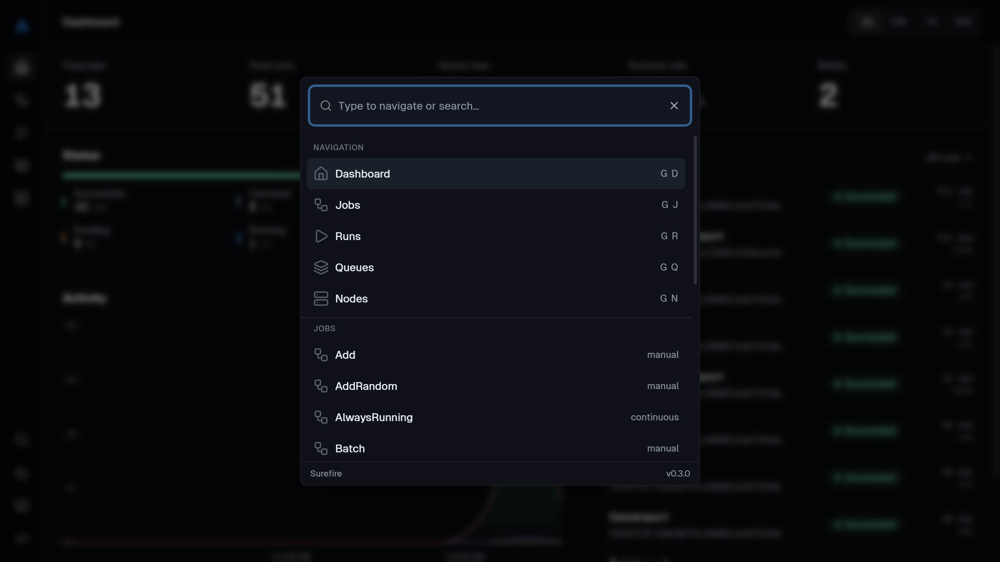

## REST API

The dashboard is built on a REST API at `{prefix}/api/`. Use it to query jobs and runs, stream run updates, and manage runs and queues from your own tools.

```
GET   /api/stats                                    # dashboard statistics
GET   /api/jobs                                     # list all jobs
GET   /api/jobs/{name}                              # get a single job
GET   /api/jobs/{name}/stats                        # get job-level stats
PATCH /api/jobs/{name}                              # update a job (enable/disable)
POST  /api/jobs/{name}/trigger                      # trigger a new run
GET   /api/runs?jobName=X&take=20                   # list runs with filters
POST  /api/runs/lookup                              # refresh many runs by id (JSON body: {"ids":[...]})
GET   /api/runs/{id}                                # get a single run
GET   /api/runs/{id}/logs                           # get parsed log events
GET   /api/runs/{id}/stream                         # live logs & progress (SSE)
GET   /api/runs/{id}/tree                           # run tree
POST  /api/runs/{id}/cancel                         # cancel a running job
POST  /api/runs/{id}/rerun                          # re-run a completed run
GET   /api/queues                                   # list all queues
PATCH /api/queues/{name}                            # update a queue (pause/resume)
GET   /api/nodes                                    # list all nodes
GET   /api/nodes/{name}                             # get a single node
```
